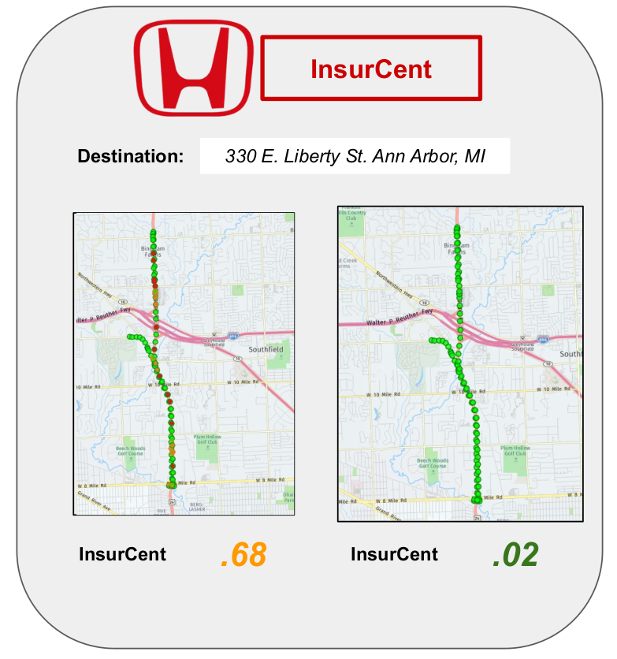

# Honda Mobility Hacks: InsurCent

Honda Mobility held a hackathon at Ann Arbor SPARK in the beginning of 2019. Teams were given access to data collected from autonomous vehicles and tasked with coming up with a novel use for the data. Three other participants and I formed a team the night of the event and our submission was awarded first place by the judges!

## Our Idea
### Can we incentivize drivers to user safer routes by gamifying insurance discounts?

[View slides outlining our idea.](https://github.com/Bcromas/honda_mobility_hacks/blob/master/content/InsurCent.pdf)

## Our Approach
We started by independently researching and brainstorming ideas and presenting them to the group. From there we provided feedback, compared and contrasted our ideas, and finally scored the ideas in terms of originality, difficulty (to implement), and customer value. Through this process we identified some overlap in the interests of drivers, insurance companies, and pedestrians/the general public. With an initial idea in hand we set about refining it further and searching for complementary third-party data ultimately incorporating data from the MapQuest API. With our idea and data identified we iteratively explored the data including the MapQuest API using both JavaScript and Python and built up a proof of concept to showcase the feasibility and value of our idea: InsurCent.    

## The Team

